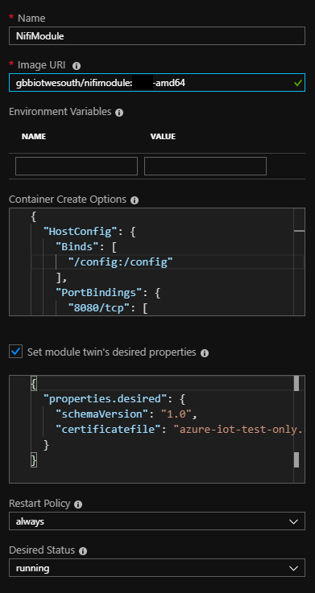
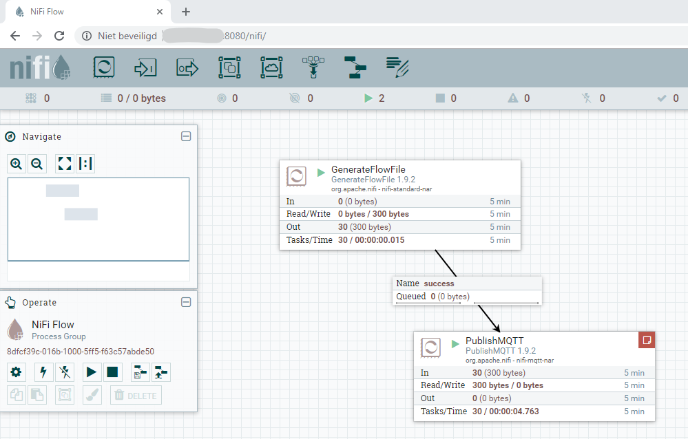
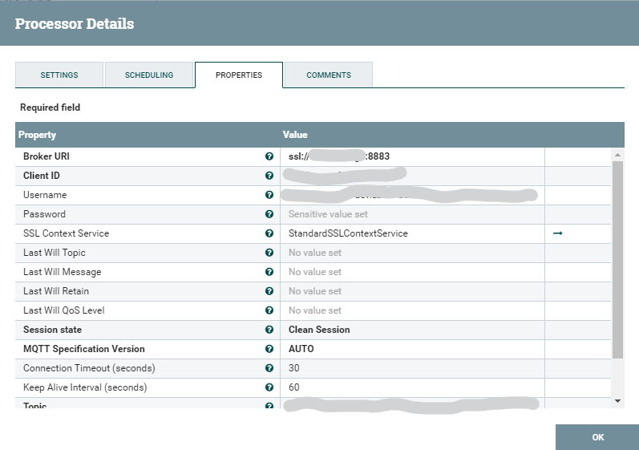
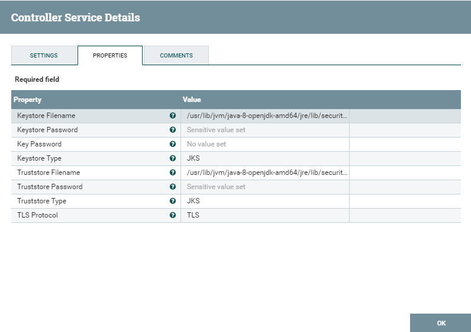
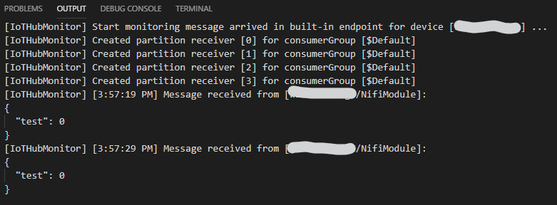

# Apache Nifi Azure Iot Edge Module
The Apache Nifi Azure Iot Edge Module is a module that can be used to run Apache Nifi on IoT Edge and use it a an ingestion module. The module is a Node.js wrapper that enables the module twin communication and starts Apache Nifi in the container. Apache Nifi can then use native MQTT connectivity (PublishMQTT processor) to communicate with the IoT Edge Hub. The code to create this module is featured in this repository, but you can also use the ready built module on Docker Hub. The documentation below will describe the steps to take to setup and deploy the ready built module to your Azure IoT Edge device.

# Steps to deploy the Apache Nifi Azure Iot Edge Module
Deploying the module will require the follwing steps:
1. Deploy a Linux X64 Iot Edge.
2. Configure an IoT Edge device to act as a transparent gateway
3. Set up Azure storage to hold the certificate file and (optional) custom Apache Nifi flow file
4. Add the module to your IoT Edge
5. Access Apache Nifi to set up the IoT Edge communication

## Deploy a Linux 64 Iot Edge
The Azure IoT Edge runtime is what turns a device into an IoT Edge device. The runtime can be deployed on devices as small as a Raspberry Pi or as large as an industrial server. Once a device is configured with the IoT Edge runtime, you can start deploying business logic to it from the cloud. The Apache Nifi module only come in the flavor AMD64 and therefor you need to setup a Linux based IoT Edge device. How to set up such a device can be found [here](https://docs.microsoft.com/en-us/azure/iot-edge/how-to-install-iot-edge-linux).
At the end of the setup create a directory "/config" on the IoT Edge and change ownership to 777 (```sudo chown 777 /config```).

## Configure an IoT Edge device to act as a transparent gateway
How to configure a IoT Edge as a transparant gateway can be found [here](https://docs.microsoft.com/en-us/azure/iot-edge/how-to-create-transparent-gateway). Please remember that the certificates generated during this process are only valid for 30 days (default). If you want you can use production certificate that have a longer lifetime or overwrite the default lifetime. During this process a certificate file with the name "azure-iot-test-only.root.ca.cert.pem" is created. We will use this file later in the process to enable the communication between the Apache Nifi module and IoT Edge.

## Set up Azure storage
Azure storage is used to store the certificate file and (optional) Apache Nifi flow file. Create a blob-storage storage account (tier: cool) and add a container to that blob-storage. Then upload the "azure-iot-test-only.root.ca.cert.pem" certificate you made in the previous step to the container, using the storage explorer. Optionally you can also upload an Apache Nifi flow file into the container. If you do add a flow file, start the name of the flow file with something that indicates a version: &lt;version&gt;.flow.xml.gz. The current flow file of an Apache Nifi deployment can be found in the "conf" directory of your Nifi installation. It has the name "flow.xml.gz". 

## Add the module to your IoT Edge
Go to the Azure potal and open up the IoT Edge device you created in the first step. Go through the steps of adding a module to the IoT Edge.



Give your module a name (f.i. NifiModule) and use "gbbiotwesouth/nifimodule:0.0.6-amd64" as the Image URI.
Use the following container create options:
```json
{
  "HostConfig": {
    "Binds": [
      "/config:/config"
    ],
    "PortBindings": {
      "8080/tcp": [
        {
          "HostPort": "8080"
        }
      ]
    }
  }
}
```
This will allow you to access Apache Nifi on port 8080 on the IoT Edge device through a browser and the downloaded certificate and floe file will be stored on the IoT Edge disk.

And use the following module twin desired properties:
```json
{
  "properties.desired": {
    "certificatefile": "azure-iot-test-only.root.ca.cert.pem",
    "flowversion": "<your flow version as create before>",
    "accountname": "<your storage account name>",
    "accountkey": "<your storage account key 1 or 2>",
    "containername": "<your container name>"
  }
}
```
These desired properties will be used to configure your Apache Nifi module. Please see the code in app.js to learn more on how these settings are used.

Go through the steps to finish the "Set Modules" process.

## Access Apache Nifi to set up the IoT Edge communication
Once the Apache Nifi module is running you can access the Apache Nifi using a browser. Browse to http://&lt;Your IoT Edge IP Address&gt;:8080/nifi and you will see the Nifi flow page.
In your case this flow will be empty. The communication between Nifi and IoT Edge uses the native MQTT protocol, to understand more on native MQTT support for Azure IoT please go [here](https://docs.microsoft.com/en-us/azure/iot-hub/iot-hub-mqtt-support). The assumption is that you know how to work with Apache Nifi and the flow designer. If you don't please visit the [Apache Nifi site](https://nifi.apache.org/) to learn more.



To enable the communication with IoT Edge, you have to add a PublishMQTT processor to the flow.




Use the following settings:
- Broker URI: ssl://&lt;nameof your edge device&gt;:8883
- Client ID: &lt;name of your edge device&gt;/&lt;name of your module&gt;
- Username: &lt;your IoT Hub&gt;.azure-devices.net/&lt;name of your edge device&gt;/&lt;name of your module&gt;/?api-version=2018-06-30
- Password: &lt;your Iot Edge SAS token&gt; <br/>See: https://docs.microsoft.com/en-us/azure/iot-hub/iot-hub-mqtt-support#using-the-mqtt-protocol-directly-as-a-device. You can use the cross-platform Azure IoT Tools for Visual Studio Code or the Device Explorer tool to quickly generate a SAS token that you can copy and paste.
- Topic: devices/&lt;name of your edge device&gt;/modules/&lt;name of your module&gt;/messages/events/
- QoS: 1
- Retain Message: false

Create a StandardSSLContextService and use this as the SSL Context Service for the PublishMQTT processor.



Use the following settings for the StandardSSLContextService:
- Keystore Filename: /usr/lib/jvm/java-8-openjdk-amd64/jre/lib/security/cacerts
- Keystore Password: changeit
- Keystore Type: JKS
- Truststore Filename: /usr/lib/jvm/java-8-openjdk-amd64/jre/lib/security/cacerts
- Truststore Password: changeit
- Truststore Type: JKS
- TLS Protocol: TLS

If everything was executed correctly, the module will have stored the provided certificate in the Java JDK keystore and will now be used to communicate with th IoT Edge Hub.

If you want the flow to actually send some information, you have to create another processor that sends its data to the PublishMQTT processor. In my flow I added a GenerateFlowFile, set the interval to 5 seconds and connected it to the PublishMQTT.
You can use the Azure IoT Hub extension in Visual Studio Code to start monitoring the messages that come from your IoT Edge device. If you've set up everything correctly you should see the message somming in a messages form an IoT Edge module.



# Contributing
This project welcomes contributions and suggestions.

This project has adopted the [Microsoft Open Source Code of Conduct](https://opensource.microsoft.com/codeofconduct/).
For more information see the [Code of Conduct FAQ](https://opensource.microsoft.com/codeofconduct/faq/) or
contact [opencode@microsoft.com](mailto:opencode@microsoft.com) with any additional questions or comments.